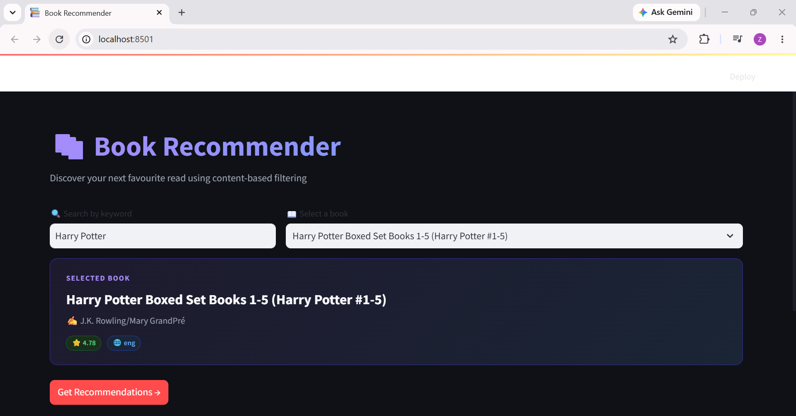
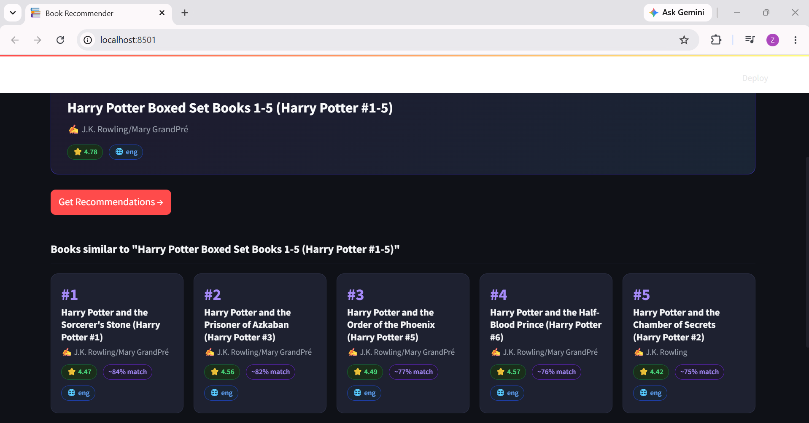

# 📚 Book Recommendation System

A content-based book recommendation system built with Python, Scikit-learn, and Streamlit.

## Screenshots

### Home Page



### Recommendations



---

## How It Works

1. **Dataset** — Goodreads Books dataset from Kaggle (~11,000 books)
2. **Text Processing** — Title, author, genre, and description are combined into a single text field
3. **TF-IDF Vectorization** — Converts book text into numerical feature vectors
4. **Cosine Similarity** — Measures similarity between books
5. **Recommendations** — Returns the top 5 most similar books for the selected title

---

## Tech Stack

* Python 3.10+
* Scikit-learn
* NLTK
* Streamlit
* Pandas
* NumPy

---

## Project Structure

```text
book-recommendation-system/
├── app.py
├── books.csv
├── notebook.ipynb
├── requirements.txt
├── README.md
└── assets/
    ├── homepage.png
    └── recommendations.png
```

---

## Run Locally

```bash
# Clone repository
git clone https://github.com/ZonashaMarium06/book-recommendation-system.git

cd book-recommendation-system

# Install dependencies
pip install -r requirements.txt

# Run application
streamlit run app.py
```

---

## Dataset

Goodreads Books Dataset (Kaggle)

https://www.kaggle.com/datasets/jealousleopard/goodreadsbooks

---

## Notes

The files `book_list.pkl` and `similarity.pkl` are generated during model building and are not included in this repository because of size limitations.

---

Built by Zonasha Marium

